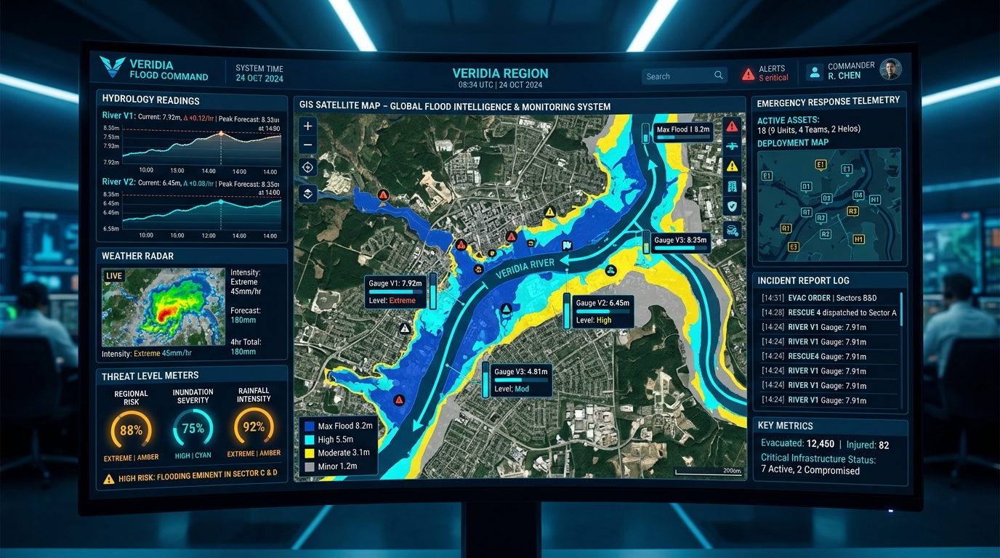
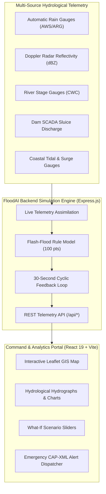

# 🌊 FloodAI – Live Flood Intelligence Platform

[](https://react.dev/)
[](https://vitejs.dev/)
[](https://tailwindcss.com/)
[](https://leafletjs.com/)
[](https://expressjs.com/)
[](LICENSE)

> **Interactive Full-Stack GIS & Hydrological Intelligence Prototype**  
> *Real-time flood risk forecasting, multi-sensor telemetry assimilation, 55-year historical analytics, and ground truth validation.*

---



---

### 🌐 Quick Access Links
- **Local Application Portal:** [http://localhost:5173/](http://localhost:5173/)
- **Backend Telemetry API:** [http://localhost:5000/](http://localhost:5000/)

---

## ⚠️ Important Prototype Notice & Model Disclaimers

> [!IMPORTANT]
> **Research and Demonstration Prototype:**  
> FloodAI is engineered as an interactive proof-of-concept for live flood monitoring and hydrologic modeling. All real-time telemetry, radar reflectivity, and sensor streams currently operate using high-fidelity **simulated data**.
>
> 1. **Not Official Emergency Warnings:** Risk scores (0–100), alert thresholds (Low, Moderate, High, Extreme), and inundation forecasts are computational estimates and **MUST NOT** be used as official disaster advisories. For active emergency alerts, refer to official authorities including the **Central Water Commission (CWC)**, **India Meteorological Department (IMD)**, and local **State Disaster Management Authorities (SDMA)**.
> 2. **Satellite Depth Uncertainty:** Satellite observations (Optical and Synthetic Aperture Radar / SAR) detect surface water extent, not bathymetric depth. Estimated water depths are generated via digital elevation model (DEM) hydrologic routing and carry uncertainty bounds of approximately ±0.15–0.30 meters.
> 3. **Statistical Return Periods:** Return period estimates (e.g., 100-year event) represent annual exceedance probabilities (e.g., 1% annual probability under stationary assumptions) rather than literal occurrence intervals.
> 4. **Ground Observation Mandate:** Operational deployment requires rigorous field calibration with ultrasonic gauge sticks, pressure transducers, and CWPRS telemetry stations.

---

## 🌟 Key Platform Features

1. **Main Dashboard & Real-Time Threat Status:**
   - Prominent Threat Card with animated color-coded status (`LOW` = Green, `MODERATE` = Yellow, `HIGH` = Orange, `EXTREME` = Red).
   - Real-time Risk Score (0–100) with confidence interval and uncertainty bounds.
   - Live KPI cards: 1h/3h/6h/24h rainfall accumulation, forecast rainfall, river stage vs bankfull level, reservoir storage percentage, soil saturation, flood extent (km²), flood depth range, duration, recession status, and impacted roads/buildings.

2. **Geographic & Hydrological Hierarchies:**
   - Multi-tier administrative drill-down: `Country → State → District → City → Town → Village`.
   - Hydrological basin hierarchy: `River Basin → Sub-basin → Watershed Catchment → River/Stream → Local Inundation Area`.
   - 9 pre-configured high-vulnerability study zones:
     - **Chennai** (Adyar River & Chembarambakkam Reservoir, coastal surge)
     - **Mumbai** (Mithi River & Vihar Lake, spring tide locking)
     - **Hyderabad** (Musi River & Himayat/Osman Sagar reservoirs)
     - **Guwahati** (Brahmaputra River Saraighat gauge, urban basin waterlogging)
     - **Kochi** (Periyar River & Idukki dam discharge cascade, tidal backwaters)
     - **Vijayawada** (Krishna River & Prakasam Barrage, Budameru flash rivulet)
     - **Kolkata** (Hooghly River tidal bore & East Kolkata Wetlands)
     - **Delhi** (Yamuna River Old Railway Bridge & Hathnikund barrage releases)
     - **Morigaon Village** (Assam rural Brahmaputra char embankment floodplains)

3. **GIS Inundation Map (Leaflet & OpenStreetMap):**
   - Toggleable vector layers:
     - Flood Inundation Extent (polygons colored Green, Yellow, Orange, Red)
     - River Channels & Streams with flow dynamics
     - Reservoirs & Dams with storage markers
     - Rain Gauges (AWS & ARG) with live precipitation telemetry
     - Evacuation Centres & Emergency Shelters (with capacity and open status)
     - Critical Roads (differentiating submerged links vs elevated corridors)
     - Cyclone Track & Projected Cone of Uncertainty (for coastal locations)
   - Interactive Zone Inspector: Click any flood zone to inspect water depth, confidence percentage, onset time, duration, exposed population, and nearest shelter.

4. **Transparent Flash-Flood Rule-Based Model:**
   - Fully open formula breakdown:
     - Rainfall accumulation & intensity: **35 pts**
     - Antecedent soil saturation: **25 pts**
     - Terrain slope & relief: **15 pts**
     - Watershed shape & confluence: **15 pts**
     - Drainage condition & imperviousness: **10 pts**
   - Interactive **what-if** parameter sliders allowing users to simulate cloudburst scenarios and observe live potential score recalculation.

5. **River & Reservoir Intelligence:**
   - Dynamic channel geometry, width, current water level, bankfull threshold, discharge, velocity, and upstream rainfall.
   - Dynamic Hydraulic Capacity Notice: Channel capacity changes with geometry, sedimentation, vegetation, and downstream tidal locks.
   - 48-Hour Historical + 24-Hour Predictive Hydrograph Chart with bankfull threshold and historical peak reference lines.
   - Upstream Dam Cascade: Visual tracking from Catchment Rainfall → Inflow Runoff → Storage Capacity → Spillway Releases → Downstream River Risk.

6. **Flood Event Timeline & Recovery Analytics:**
   - Multi-stage event sequence: *Rainfall Commences → Surface Accumulation → Flood Onset → Flood Peak → Recession Starts → Return to Baseline*.
   - Recession progress percentage, elapsed time since peak, and estimated time to normal.
   - Extent (km²) and Depth (m) decay curves over time vs historical baseline.

7. **Extreme Rainfall Analytics:**
   - 1h, 3h, 6h, 12h, 24h, and multi-day accumulation.
   - Rainfall anomaly classification (`Normal`, `Unusual`, `Severe`, `Exceptional`).
   - Gumbel return periods (2-yr, 5-yr, 10-yr, 25-yr, 50-yr, 100-yr) with scientifically accurate 1% exceedance probability phrasing.

8. **Meteorological Telemetry & Weather Stations:**
   - Automated Weather Stations (AWS), Automated Rain Gauges (ARG), Doppler Weather Radar (reflectivity dBZ), and satellite cloud observations.
   - Atmospheric temperature, humidity, wind velocity/direction, barometric pressure, and 25km lightning strike counters.

9. **55-Year Historical Intelligence (1970–2025):**
   - Decadal rainfall trends and extreme 24h cloudburst history.
   - Interactive historical table with sorting, filtering, and flood event tags.

10. **Land-Use Change Detection (2020 vs 2025):**
    - Transition matrix: Vegetation, Built-up area, Open soil, Paved roads, Wetlands, and Water bodies.
    - Impervious surface runoff coefficient impact on peak flood concentration time.
    - 5-step satellite change detection pipeline.

11. **Coastal & Cyclone Intelligence:**
    - Active for coastal cities (Chennai, Mumbai, Kochi, Kolkata).
    - Astronomical tide levels, storm surge heights, wave heights, and estuary outfall backflow.
    - Compound coastal flood index formula.
    - Cyclone track waypoints, central pressure, wind speeds, and landfall trajectory.

12. **Ground Truth Validation & Calibration:**
    - Statistical metrics: Precision, Recall, F1 Score, Spatial IoU (0.81+), Depth RMSE (±0.16m), and Lead Time.
    - Multi-source observation table cross-referencing predictions against telemetry sensors, citizen IoT, and UAV photography.

13. **Continuous 30-Second Live Assimilation Loop:**
    - Cyclic 12-stage feedback engine continuously updating telemetry, running calculations, and archiving verified records.

---

## 🏗️ Architecture

```
Flood detection/
├── package.json              # Root script coordination
├── run-dev.js                # Unified concurrent process manager
├── .env.example              # Configuration variables
├── README.md                 # Complete documentation
├── server/
│   ├── package.json
│   ├── server.js             # Express REST API (13 endpoints + 30s simulation loop)
│   └── mockData/
│       ├── locations.js      # Geographic & hydrological hierarchies
│       ├── historicalData.js # 1970–2025 simulated historical records
│       ├── liveState.js      # State engine with dynamic jitter & scoring
│       ├── riverReservoir.js # Cross-sections, hydrographs, & dam cascades
│       ├── landUseData.js    # 2020 vs 2025 transition matrix & satellite pipeline
│       ├── coastalData.js    # Tides, surge, & cyclone waypoints
│       └── validationData.js # Confusion matrix, IoU, & sensor observations
└── client/
    ├── package.json
    ├── vite.config.js        # Vite dev server with /api proxy to :5000
    ├── index.html
    └── src/
        ├── main.jsx
        ├── App.jsx           # Global state & navigation coordination
        ├── index.css         # Glassmorphic design system & Leaflet dark styling
        └── components/
            ├── Header.jsx           # Location search & hierarchies
            ├── MainDashboard.jsx    # Status card, KPI grid, & risk factors
            ├── GisMap.jsx           # Leaflet interactive map with custom layers
            ├── FlashFloodModel.jsx  # Interactive transparent equation
            ├── RiverReservoir.jsx   # River hydrographs & reservoir table
            ├── FloodTimeline.jsx    # Stage sequence & recovery curves
            ├── ExtremeRainfall.jsx  # GEV return periods & anomaly
            ├── WeatherStations.jsx  # Radar reflectivity & sensor telemetry
            ├── HistoricalIntel.jsx  # 55-year trends & sortable table
            ├── LandUseChange.jsx    # Sprawl comparison & pipeline
            ├── CoastalCyclone.jsx   # Storm surge & cyclone track
            ├── GroundValidation.jsx # Spatial IoU & ground truth log
            └── FeedbackLoop.jsx     # 12-step assimilation cycle
```

---

## 🏛️ System Architecture



---

## 🚀 Quick Start Guide

### Prerequisites
- **Node.js**: v18.0.0 or higher (v24+ recommended)
- **npm**: v9.0.0 or higher

### Installation

From the project root directory:

```bash
npm install
```

*(This automatically installs dependencies for both `server` and `client` via the root postinstall hook).*

### Running Locally

To launch both the backend API server and Vite frontend simultaneously:

```bash
npm run dev
```

- **Frontend Dashboard**: `http://localhost:5173`
- **Backend API**: `http://localhost:5000`

> **Note on Demo Mode:** No external API keys or third-party accounts are required. The platform launches with all features, interactive sliders, maps, charts, and auto-refresh mechanisms working immediately.

---

## 📡 REST API Specification

| Method | Endpoint | Description |
|---|---|---|
| `GET` | `/api/locations` | List all 9 pre-configured hydrological monitoring locations |
| `GET` | `/api/location/:id` | Detailed geographic & hydrological hierarchy for location |
| `GET` | `/api/dashboard/:locationId` | Main telemetry, risk score, KPI metrics, and risk factors |
| `GET` | `/api/historical/:locationId` | 55-year annual rainfall and flood event time-series (1970–2025) |
| `GET` | `/api/rainfall/:locationId` | Extreme precipitation intervals, return periods, and anomaly |
| `GET` | `/api/weather/:locationId` | Real-time weather stations, Doppler radar, and satellite feeds |
| `GET` | `/api/rivers/:locationId` | River morphology, stage, bankfull percentage, and hydrographs |
| `GET` | `/api/reservoirs/:locationId` | Upstream dam storage, inflow/outflow, and spillway status |
| `GET` | `/api/flood/:locationId` | Inundation extent, depth ranges, duration, and recovery curves |
| `GET` | `/api/land-use/:locationId` | 2020 vs 2025 land-cover transition matrix and runoff impacts |
| `GET` | `/api/coastal/:locationId` | Marine tides, storm surge, and cyclonic track forecast |
| `GET` | `/api/validation/:locationId` | Spatial IoU, Precision, Recall, and ground truth sensor records |
| `POST` | `/api/refresh/:locationId` | Trigger an immediate live sensor simulation cycle |

---

## 🔬 Risk Scoring Methodology

Composite flood risk is calculated from synchronous multi-variable convergence:

$$\text{Risk Score} = (0.45 \times \text{Flash Flood Potential}) + (0.35 \times \text{Bankfull Saturation \%}) + (0.20 \times \text{Soil Moisture \%})$$

- **Flash Flood Potential (0–100):** Transparent sum of Rainfall Accumulation (35 pts), Soil Saturation (25 pts), Terrain Slope (15 pts), Watershed Characteristics (15 pts), and Drainage Impedance (10 pts).
- **Compound Coastal Risk:** Incorporates Astronomical Tide, Storm Surge, Cyclone Wind Pressure, and River Estuary Backflow.

---

## 💡 Future Enhancements

1. **Direct CWC & IMD API Integration:** Ingest live Open Government Data (OGD) sensor endpoints.
2. **Sentinel-1 SAR Auto-Delineation:** Ingest real-time Copernicus European Space Agency (ESA) GRD radar tiles using cloud-optimized GeoTIFFs (COG).
3. **Machine Learning Downscaling:** High-resolution physics-informed neural networks (PINNs) for urban street-level hydrodynamic flood depth prediction.
4. **Offline Mobile Mesh Sync:** Offline-first PWA mode for field first responders using WebRTC peer-to-peer data relay.

---

## 📜 License & Acknowledgements
- OpenStreetMap & CartoDB tile services.
- Hydrological references based on Central Water Commission (CWC) and India Meteorological Department (IMD) standard guidelines.
- Distributed under the MIT License for educational, research, and disaster resilience innovation.
